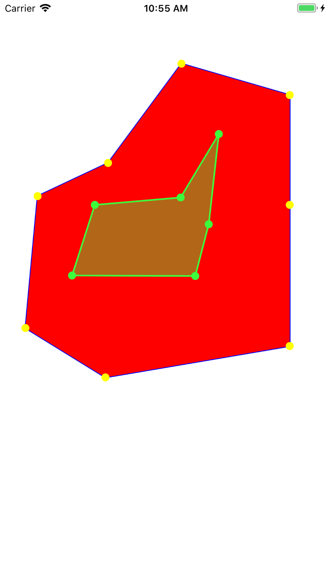

# ZJSPolygonView
The Polygon can move points.



```
    self.demo4View = [[ZJSPolygonView alloc] init];
    self.demo4View.polygonFillColor = [UIColor redColor];
    self.demo4View.polygonBorderColor = [UIColor blueColor];
    self.demo4View.pointColor = [UIColor yellowColor];
    self.demo4View.frame = CGRectMake(10, 80 , width, width);
    self.demo4View.points = @[[[ZJSPolygonPoint alloc] initWithX:0.1 y:0.1],
                              [[ZJSPolygonPoint alloc] initWithX:0.45 y:0.1],
                              [[ZJSPolygonPoint alloc] initWithX:0.9 y:0.1],
                              [[ZJSPolygonPoint alloc] initWithX:0.9 y:0.45],
                              [[ZJSPolygonPoint alloc] initWithX:0.9 y:0.9],
                              [[ZJSPolygonPoint alloc] initWithX:0.45 y:0.9],
                              [[ZJSPolygonPoint alloc] initWithX:0.1 y:0.9],
                              [[ZJSPolygonPoint alloc] initWithX:0.1 y:0.45]];
    [self.view addSubview:self.demo4View];
```